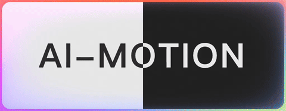

# AI Motion

[](https://www.npmjs.com/package/ai-motion)
[](https://github.com/gaomeng1900/ai-motion/actions)
[](https://www.npmjs.com/package/ai-motion)
[](https://opensource.org/licenses/MIT)

WebGL2 animated border with AI-style glow effects. Zero dependencies, modern browsers only.



## Install

```bash
npm install ai-motion
```

## Quick Start

```ts
import { Motion } from 'ai-motion'

const motion = new Motion({
    width: 400,
    height: 300,
    mode: 'light'
})

document.body.appendChild(motion.element)
motion.start()
```

## API Reference

### Constructor

```ts
new Motion(options?: MotionOptions)
```

Creates a new Motion instance with WebGL2 canvas element.

> Throw error if the browser does not support WebGL2.

### Methods

#### `start(): void`

Starts the animation loop (cap to 30 fps). Safe to call multiple times.

```ts
motion.start()
```

#### `pause(): void`

Pauses the animation loop. Preserves state.

```ts
motion.pause()
```

#### `dispose(): void`

Cleans up WebGL resources and removes canvas. Instance becomes unusable.

```ts
motion.dispose()
```

#### `resize(width: number, height: number, ratio?: number): void`

Resizes canvas and rebuilds geometry. Updates image immediately if running.

```ts
motion.resize(800, 600)
motion.resize(800, 600, 2) // with custom pixel ratio
```

#### `autoResize(element: HTMLElement): void`

Auto-resizes to match target element using ResizeObserver.

```ts
const container = document.getElementById('container')
motion.autoResize(container)
```

#### `fadeIn(): Promise<void>`

Animates opacity 0→1 with scale effect (300ms).

```ts
await motion.fadeIn()
```

#### `fadeOut(): Promise<void>`

Animates opacity 1→0 with scale effect (300ms).

```ts
await motion.fadeOut()
```

### Properties

#### `element: HTMLElement`

The canvas element. Append to DOM where needed.

```ts
document.body.appendChild(motion.element)
```

## Options

```ts
interface MotionOptions {
    width?: number          // Canvas width (default: 600)
    height?: number         // Canvas height (default: 600)
    ratio?: number          // Device pixel ratio multiplier (default: devicePixelRatio)
    mode?: 'dark' | 'light' // Color optimization (default: 'light')
    borderWidth?: number    // Border thickness (default: 8)
    glowWidth?: number      // Glow effect width (default: 200)
    borderRadius?: number   // Corner radius (default: 8)
    classNames?: string     // CSS classes for canvas
    styles?: Partial<CSSStyleDeclaration> // CSS styles for canvas
}
```

### Mode Details

- **`light`**: High saturation, works better on light backgrounds
- **`dark`**: Clean luminous glow, works better on dark backgrounds

Choose based on your background color. Use light mode if you cannot decide.

## Examples

### Fullscreen Background

```ts
const motion = new Motion({
    width: document.documentElement.clientWidth,
    height: document.documentElement.clientHeight,
    mode: 'dark',
    styles: {
        position: 'fixed',
        inset: '0',
    }
})

document.body.appendChild(motion.element)
motion.autoResize(document.body)
motion.start()
```

### Responsive Container

```ts
// container.style.position: absolute/relative
const container = document.getElementById('hero')
const motion = new Motion()

container.appendChild(motion.element)
motion.autoResize(container)
motion.start()

// Fade in animation
await motion.fadeIn()
```

## Requirements

- WebGL2 support
- Modern browsers

## Development

```bash
npm install
npm start      # dev server
npm run build  # library build
```

## License

MIT
